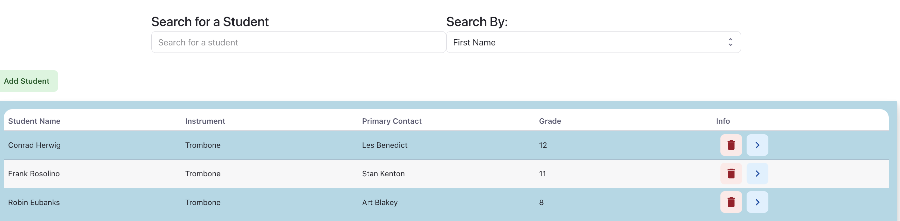
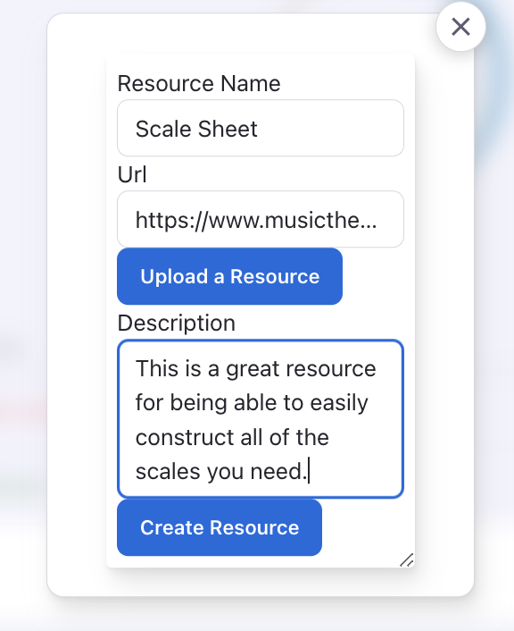
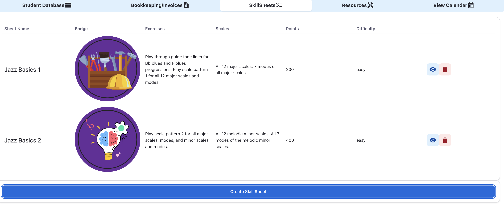

# Studio Hub - Music Teaching Management Tool

## Description

This application is designed specifically for music teachers with the aim of helping to organize information for their students, create and track a student's progress by creating practice plans, assignments, and skill sheets, as well as provide incentives through a points system.

## Table of Contents

1. [Installing Dependencies](#installing-dependencies)
2. [Usage](#usage)
3. [Contributing](#contributing)
4. [Testing](#testing)
5. [Reporting Errors](#reporting-errors)
6. [License](#license)
7. [Questions](#questions)

## Installing Dependencies

`npm install`

## Usage

The application is designed so that teachers and students can use it dynamically. Teachers can create a profile and then add students to their profile. Teachers will be able to add pertinent information for each student including contact information, school, grade, instrument, and more. For each student, they can create a practice plan and associated assignments for students to complete. They may choose to assign points to each assignment so that upon completion, students can earn points which will accumulate and earn them badges as their score increases. The assignment template is very flexible and allows teachers to create their own categories, assignment types, and exercises.

Teachers have the option to upload resources for students and attach them to a practice plan. Students will be able to see a collection of all the resources that have been uploaded to their practice plans in a separate area on the page. These resources will be uploaded using Cloudinary media storage and will create a link that students can use to access the materials. Teachers can also use existing links on the internet as a resource.

Teachers also have the option to create skill sheets which can be used to provide benchmark challenges for students. Points can be assigned to these as well. These are also extremely flexible as a template. There are some suggested fields but teachers can create any set of exercises and upload any resources they desire for each skill sheet.

Currently in development is a virtual tutor that will help students walk through some basic steps to help with identifying problems in their playing.

Future development will include a bookeeping/invoices feature for private teachers to be able to stay organized with student payments, a message board for teachers to post information for their students, and more!

The application is live at this link: [Studio Hub](https://studio-hub-2240901ba348.herokuapp.com/)

## Contributing

There are open issues in the repo. Fork the repo and make a pull request in order to submit a change for the application.

## Testing

No tests at the momemnt

## Reporting Errors

Please report any errors to andy.kleindienst@gmail.com.

## License

MIT License

## Questions

For any questions regarding this project, please send correspondence to andy.kleindienst@gmail.com.

Please visit my profile on [GitHub](https://github.com/andykb9b13).
